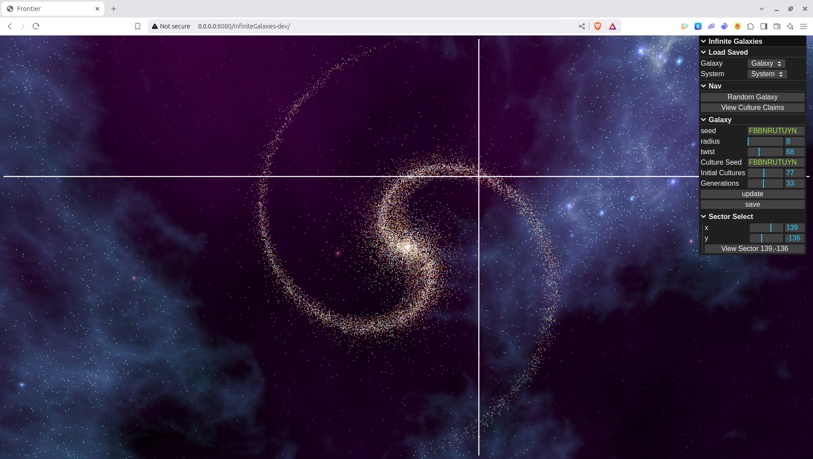
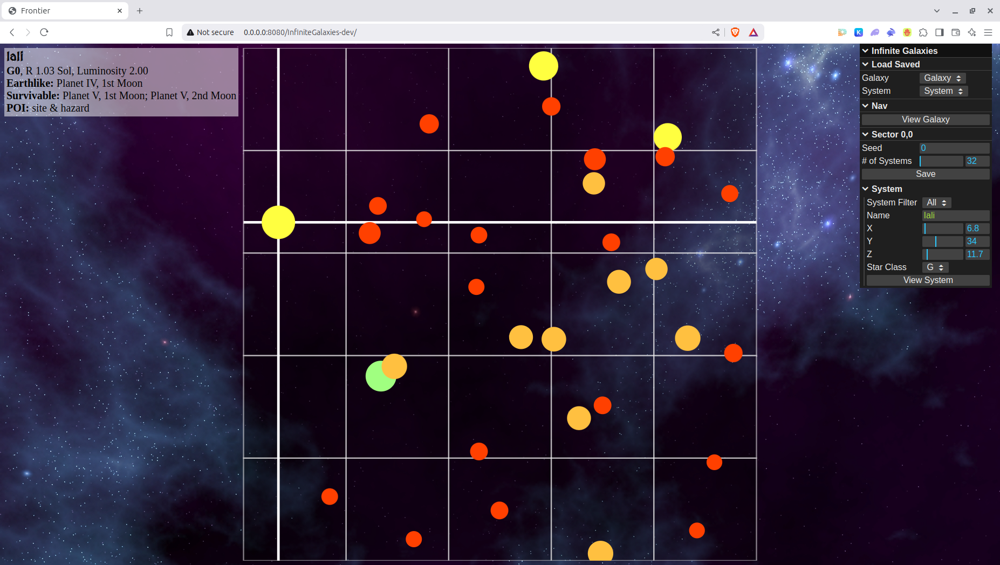
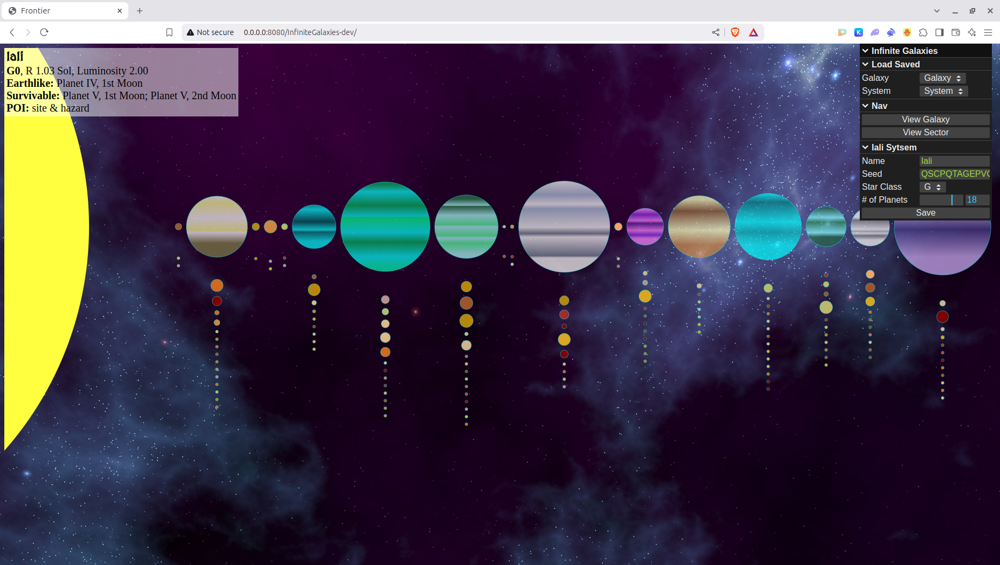
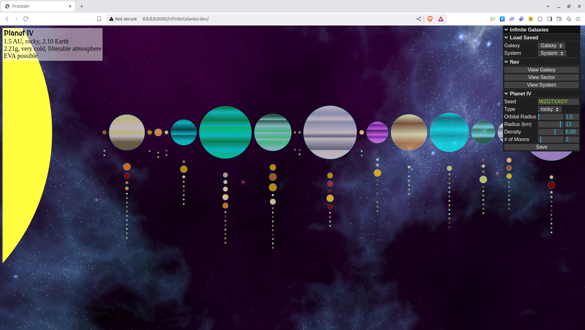

# Infinite Galaxies

Procedural generation of an entire galaxy, rendered in 3D with Three.js and procedural terrain via the World Engine.

## Galaxies

When you first open the page you will be greeted with a randomly generated galaxy rendered as a 3D star field. All of your tools to edit the galaxy will always be in the GUI on the right. Use OrbitControls to rotate the view (locked at 45° to the galactic plane).

Galaxies have the following inputs:
- Seed: The core seed for random generation. It effects the whole galaxy and everything else within.
- Radius: The galaxy radius in 1000 ly increments. Between 40,000 and 60,000; the Milky way is ~50,000 ly.
- Twist: How tight the spiral of the galaxy is. Between 30 and 150.
- Culture Seed: You can set a different seed to generate the cultures of the galaxy. Currently cultures are not fully implemented, but you can see their claims.
- Initial Cultures: Number of cultures to seed the galaxy with initial.
- Generations: Number of generations to iterate for cultural expansion.

**You have to press *update* to make any changes to the galaxy. You have to press *save* to save your changes so the galaxy is available after you reload the page.**

If you save your galaxy, when you come back you can select the galaxy seed from the dropdown on the right to load your saved work. If you modify any systems, they will be saved as well and you can go directly to them by selecting them from the dropdown as well.

You can click anywhere on the galaxy to select individual sectors. Their ID appears in the "Sector Select" folder of the GUI. A crosshair marks the selected sector.



## Sectors

The galaxy is sliced into 1000 ly cubic regions of space (1000 ly × 1000 ly × 1000 ly) called **sectors**. A sector is identified by its location (x, y) within the galactic plane. Each star is a clickable sprite; clicking selects the system and shows its info.

The sector view uses an orthographic camera with zoom (0.5×–20×) and a grid overlay. Star positions are rendered in 3D with z-depth, and a three-axis crosshair marks the selected system.

Sectors have the following inputs:
- Seed: A seed that will modify the generation of the systems within the sector.
- #of Systems: How many systems to generate within the sector. Between 32 and 256. The more systems, the longer the generation will take and the more crowded the display will be.



Click the save button to save changes you made to a particular sector. This automatically saves the galaxy as well. You will be able to select the sector from the main galaxy page on reload.

You can click on any star to get information about the system. Information will display on the top left, and you can edit various attributes in the bottom right of the GUI.

System inputs:
- Name
- Position: The x, y, and z coordinates of the system within the sector.
- Star Class: Change the primary star of the system. This will change how the planets are generated.

## Systems

The individual star systems that make up the galaxy. Each has its primary star (rendered with a procedural sun shader — sphere, rays, flares, and glow) and a row of planets with their own moons generated using World Engine terrain meshes.

Planets are visible at medium LOD (N=3000). Clicking a planet upgrades its mesh to high detail (N=20000) and zooms the camera for close inspection. Planets have classification-based visual types: earthlike, barren, airless, and gas giants (with a procedural banded shader).

System inputs:
- Name
- Seed: This seed effects how the system is generated. If changed, it will change the orbits, planet types and POI.
- Star Class: Change the primary star of the system. This will change how the planets are generated.
- #of Planets: The number of planets. Between 0 and 24. Changing this will change orbits and planet types.



Click the save button to save changes you made to the system. This automatically saves the galaxy as well. You will be able to select the system from the main galaxy page on reload.

If you click on any planet or moon you can view their information (top left), upgrade the mesh to full detail, zoom into a close-up view, and edit some of their attributes in the GUI.

Planet/Moon inputs:
- Seed: This seed effects how planet is generated. If changed, it could change temperature, hydrology, atmosphere, and any features (to be implemented).
- Type: The type of planet. May be rocky (earthlike/barren/airless), gas giant, or brown dwarf.
- Orbital Radius: Change the orbit of the planet, measured in AU.
- Radius: The radius of the planet. This will change the gravity and habitability.
- Density: The density of the planet. This will change the gravity and habitability.
- #of Moons: The number of moons. Changing this will change their orbits as well.



## Architecture

The codebase is split into two layers:

### Engine (`src/engine/`)

All data generation lives here — no UI dependencies, no Three.js imports, no `App` references. Each class creates and manages its own domain objects:

- `Galaxy` — spiral galaxy with cultures, sectors map
- `MajorSector` — 1000 ly³ region containing star systems
- `System` — star + planets + POI
- `Planet` / `Moon` — planetary bodies with physics-based generation

Engine classes accept callbacks (`onClick`, `display`, `save`, `setCrosshair`) passed via constructor options or set as properties. These callbacks are stored as `_onClick`, `_display`, etc. The class methods call these with `self` as the first argument, letting the consumer wire in rendering without the engine knowing about it.

```
display() → this._display(this, { onSectorClick: ... })
click     → this._onClick(this, 'eventType', data)
save()    → this._save(this.data)
```

Child classes inherit callbacks from their parent — `MajorSector.refresh()` passes its `_onClick`/`_display` to every `new System()` it creates.

### App Layer (`main.js`)

Imports both engine classes and Three.js view functions and bridges them via callbacks:

```
Galaxy._display    → setGalaxyView(self, events)
MajorSector._display → setSectorView(self, events)  
System._display    → setSystemView(self, events)
System._onClick    → info updates, GUI setup, planet upgrade/zoom
```

The `UI/` directory contains lil-gui setup functions that read/write engine object properties, keeping GUI wiring separate from both the engine and the renderer.

## Dependencies

Three.js via CDN importmap (`three@0.184.0`), World Engine (vendored at `src/engine/`) for procedural terrain and sun shaders, Chance.js for seeded random generation, lil-gui for the control panel. All rendering is 3D WebGL.
